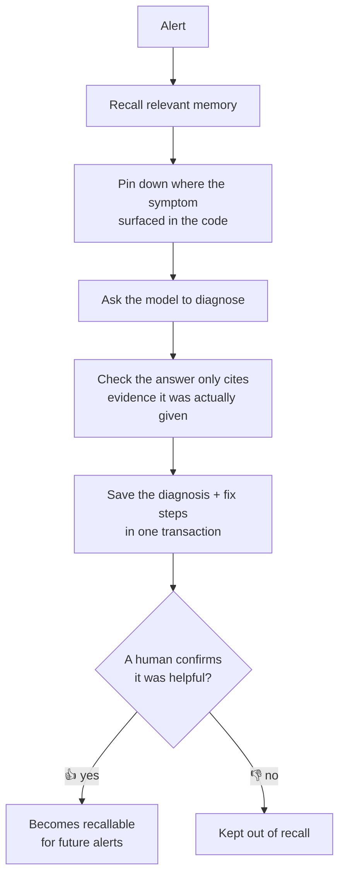
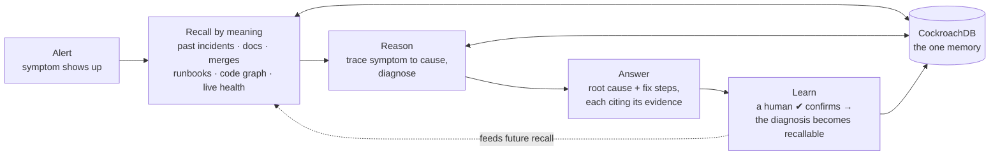
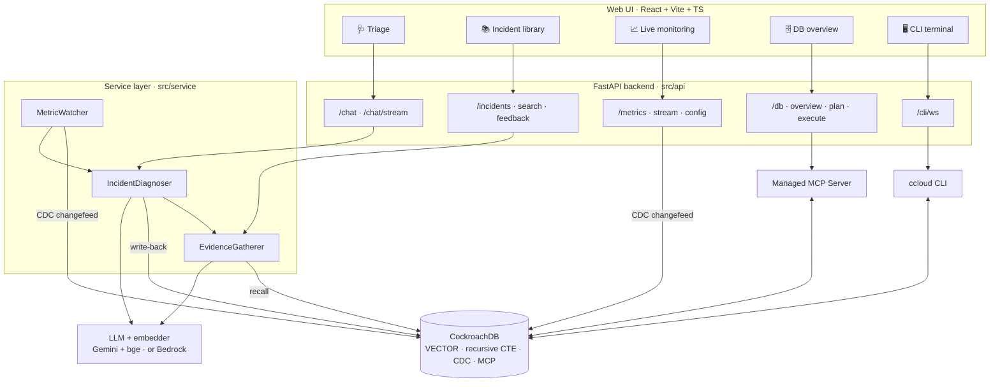

# 🦊 felix — an SRE incident-memory agent

> An on-call teammate whose value comes **entirely from memory**. For each alert
> it recalls the relevant past incidents, docs, code changes, runbooks, and code
> structure — matched by *meaning*, not keywords — traces the symptom to its
> likely cause, diagnoses, and writes the resolution back so it gets smarter over
> time.

Built for the **CockroachDB × AWS "Build with Agentic Memory"** hackathon. All
memory lives in **one CockroachDB** (native `VECTOR` search, recursive-CTE graph
traversal, and a live CDC changefeed), with pluggable reasoning and embedding
models — including **AWS Bedrock** — behind an env var.

- 📖 **Setup / run it yourself:** [SETUP.md](SETUP.md)
- 🏗️ **Code walkthrough (`src/`):** [SRC_OVERVIEW.md](SRC_OVERVIEW.md)
- 🧭 **Deep design notes / conventions:** [CLAUDE.md](CLAUDE.md)

---

## How to run

One command brings up the whole stack — CockroachDB (Docker, auto-seeded), the
Python backend, and the React frontend:

```bash
./start.sh
```

It creates the venv, installs dependencies, writes a local-dev `.env` /
`.env.local`, starts the database, and launches the API on
**http://localhost:8000** and the UI on **http://localhost:5173**. Ctrl-C stops
the app; the database keeps running in Docker.

**Prerequisites:** Docker, Python 3.10+, and Node 18+. Diagnosis (the `/chat`
path) needs a free [Gemini API key](https://aistudio.google.com/apikey) added to
`.env` as `GEMINI_API_KEY` — recall and the mock UI work without one.

For the manual step-by-step (native CockroachDB without Docker, the live CDC
demo, troubleshooting), see **[SETUP.md](SETUP.md)**.

---

## The problem

When production breaks, on-call engineers waste time rediscovering what the team
already learned: *have we seen this before? what caused it? what fixed it?* That
knowledge is scattered across old incidents, wikis, merge history, dashboards,
and the code itself. felix makes that knowledge an agent's memory — and proves
that **memory, not the model, is what makes the agent useful**.

## Feature showcase

Everything felix knows lives in **one CockroachDB**, spread across purpose-built
tables and recalled by the mechanism that fits each kind of knowledge:

| Source | Table(s) | How it's recalled |
|---|---|---|
| Past incidents (episodic) | `incidents` + `resolution_steps` | vector search |
| Project docs | `doc_chunks` | vector search |
| Recent merges | `code_changes` | vector search **+ time window** |
| Curated runbooks | `runbooks` + `runbook_steps` | vector search (by trigger text) |
| Code graph (structural) | `code_nodes` + `code_edges` | recursive-CTE traversal |
| Service topology + live metrics | `service_nodes` + `service_edges` + `metrics` | recursive-CTE downstream walk → live metric health checks |

Plus **working memory** (`active_incidents` + `active_incident_turns` — the live
multi-turn conversation) and an **audit log** (`agent_actions`).

**The reasoning loop.** When an alert comes in, felix works through these steps:



That last step is how felix stays trustworthy: a live diagnosis is saved
**without an embedding**, so it's invisible to recall until a human confirms it —
an unreviewed guess never pollutes future retrieval.

The web UI (React + Vite + TS over a FastAPI backend) surfaces all of this
across five panels:

### 1. 🩺 Triage
Alert → diagnosis. Recall runs first and fills an **evidence panel** — past
incidents, docs, code changes, runbooks, and the upstream code trace — then the
model streams its diagnosis live. Each citation links back to the evidence it
rests on (hover a citation and the source card highlights), follow-up questions
continue in the same conversation (working memory), and a short overlay replays
how recall narrowed to the answer.

### 2. 📚 Incident library
Browse every past incident, or search them by meaning — the query is embedded
and ranked by CockroachDB `VECTOR` distance. Any incident can be sent straight
to Triage as a new alert, and diagnoses a human has confirmed are marked as
such.

### 3. 📈 Live monitoring (CDC)
Live latency cards fed by a **sinkless CockroachDB changefeed** on the `metrics`
table (streamed to the browser as SSE). Each card auto-renders a live value,
sparkline, rolling **p99 / avg**, and a **⚠ tail-latency-high** badge when p99
crosses its (editable) alert threshold. When a card goes red, **Ask felix →**
jumps to Triage with a synthesized alert pre-filled.

### 4. 🗄️ DB overview (via the Managed MCP Server)
A read-only cluster snapshot — cluster metadata, databases, tables + row counts,
running queries — gathered **entirely through the CockroachDB Cloud Managed MCP
Server** (felix as its *own* OAuth MCP client; no direct SQL on this path). Plus
**"Ask felix to change the DB"**: a natural-language box that maps a request
("add a table for on-call schedules") to one MCP tool call, **previews it, and
runs it only after you confirm** — additive writes only (create/insert).

### 5. 🖥️ CLI (the ccloud terminal)
A **real interactive terminal** in the browser (xterm.js) bridged to a PTY on
the backend with the **ccloud CLI** on PATH — so `ccloud cluster list`,
`ccloud cluster sql felix-db`, etc. run for real against the authed Cloud
account. Gated behind `FELIX_CLI_ENABLED`; the API binds `127.0.0.1` (local demo
only — it's a real shell).

### And a headless real-time loop
`python -m src watch` holds the same changefeed, trips on the "p99 spikes while
avg stays flat" signature, and hands a synthesized alert to the diagnoser
automatically — the "no alert fired, but customers are complaining" story,
end to end. (See [SETUP.md §7](SETUP.md).)

---

## Architecture

**The big picture — how felix turns an alert into an answer that compounds:**



Memory is the loop, not a side store: every diagnosis a human confirms flows
back into the same CockroachDB the next alert recalls from, so felix gets sharper
over time.

**Information flow through the app** — each panel over the FastAPI backend and
the one CockroachDB behind it:



Layered under the hood: `cli/api → service → store/clients → models/config`.
Clients (embedder, LLM, MCP) are lazy-imported and swappable behind env vars.
Full walkthrough in [SRC_OVERVIEW.md](SRC_OVERVIEW.md).
